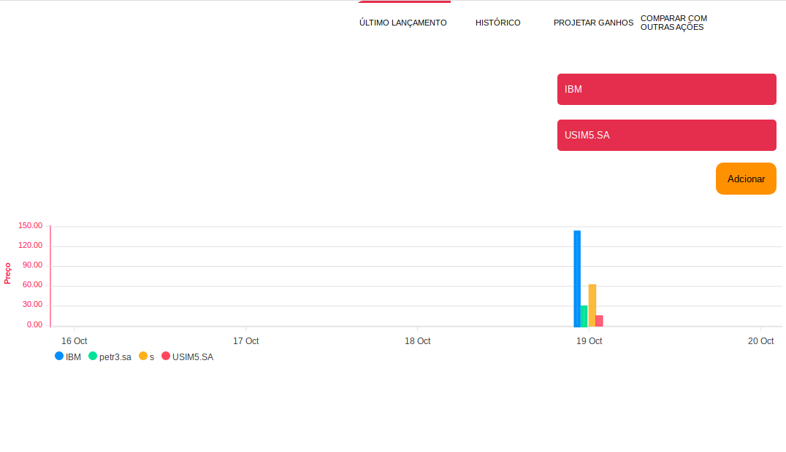
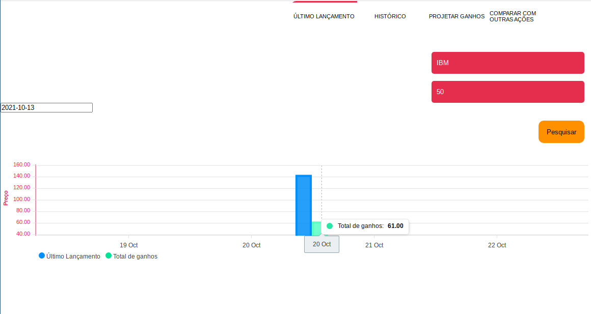
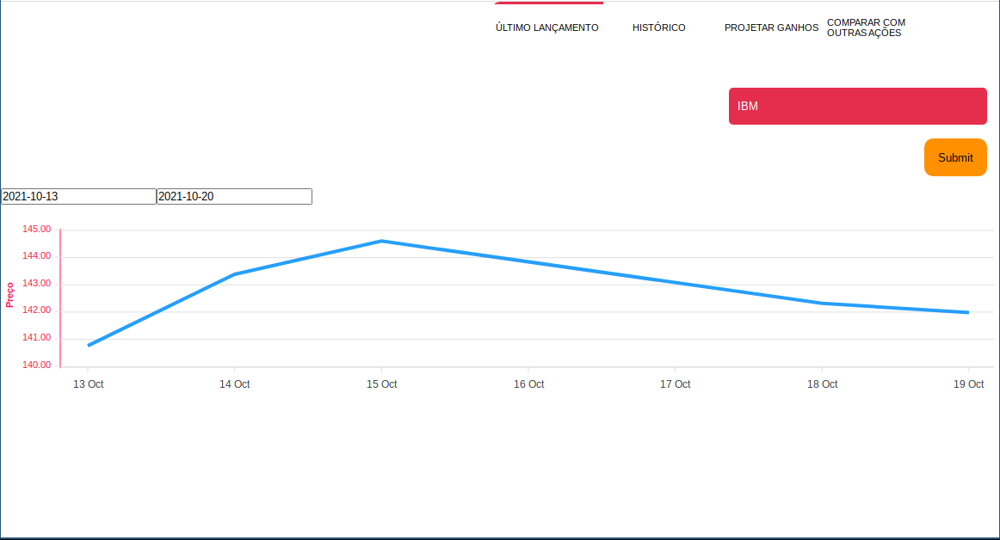
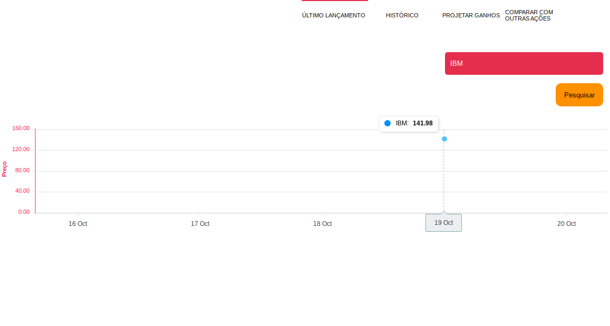

<h2><strong>App 💻</strong></h2>

  <h4><strong>Starting</strong></h4>
  <table>
    <thead>
      <tr>
        <th>Content</th>
        <th>About</th>
      </tr>
    </thead>
    <tbody>
      <tr>
        <td>
          <ol>
            <li style="font-size: 0.6rem">run-app.sh</li>
            <li style="font-size: 0.6rem">port</li>
          </ol>
        </td>
        <td>
          <ol>
            <li style="font-size: 0.6rem">
              Application deployment script using the "docker-compose"
              command run the following command on your konsole 
              <table>
                <thead>
                  <tr>
                    <th>Initialized case</th>
                    <th>Firt Boot</th>
                  </tr>
                </thead>
                <tbody>
                  <tr>
                    <td>
                      

                        sudo ./run-app.sh --init-dev
                      

                    </td>
                    <td>
                      

                        sudo ./run-app.sh --dev
                      

                    </td>
                  </tr>
                </tbody>
              </table>
            </li>
            <li style="font-size: 0.6rem"><a href="http://localhost:5488">5488</a></li>
          </ol>
        </td>
      </tr>
    </tbody>
  </table>

 

<table>
  <h4><strong>State</strong></h4>
  <tbody>
    <tr>
      <td>
        
      </td>
      <td>
        
      </td>
      <td>
        
      </td>
      <td>
        
      </td>
    </tr>
  </tbody>
</table>

 
<h2>Autor</h2>

 

Made with ❤️ for Carlos Vergilio

<strong>Contact: </strong>
<a href="https://www.linkedin.com/in/giliover">Linkedin</a>
