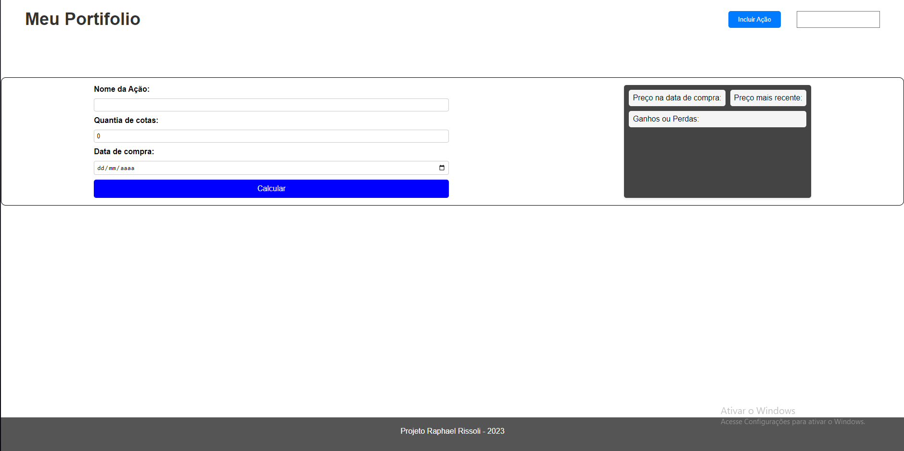

# Documentação de Software

## Introdução
<strong>Link do deploy da aplicação:</strong> <a href="https://hiring-rissoli.vercel.app">https://hiring-rissoli.vercel.app</a>

#### Descrição do software
<p>O Portifólio de Ações é um software projetado para ajudar os usuários a gerenciar e monitorar suas ações em diferentes bolsas de valores. Com a capacidade de criar um portfólio personalizado de ações e monitorar posições de investimento em tempo real, o software permite aos usuários projetar seus ganhos e perdas com base em análises de desempenho e informações atualizadas sobre o preço das ações.

Além disso, o Portifólio de Ações oferece uma interface simples e intuitiva que permite aos usuários visualizar informações detalhadas sobre cada ação em seu portfólio, como o preço atual, o histórico de preços e a variação de preços ao longo do tempo e porjetar perdas ou ganhos.</p>

#### Finalidade e objetivos

<p>O objetivo principal do Portifólio de Ações é fornecer uma ferramenta eficiente para os usuários gerenciarem suas ações de forma conveniente e segura. Com a capacidade de criar um portfólio personalizado de ações e monitorar posições de investimento em tempo real, o software permite aos usuários avaliar o desempenho de suas ações e tomar decisões informadas sobre suas posições de investimento. Além disso, o software oferece recursos avançados de análise de desempenho e informações atualizadas sobre o mercado de ações, permitindo aos usuários projetar seus ganhos e perdas com base em dados precisos e confiáveis. Com sua interface intuitiva e funcionalidades avançadas, o Gerenciador de Ações é uma opção valiosa para investidores de todos os níveis de experiência que desejam maximizar seus retornos de investimento e garantir um gerenciamento eficiente e seguro de suas ações.</p>

## Especificações de Requisitos

### Requisitos funcionais
- Incluir ações no portfólio
- Ver situação atual das ações (último preço e data e hora da atualização)
- Ver histórico de preços de uma ação, podendo delimitar datas de início e fim
- Fazer projeção de ganhos de uma ação, determinando o número de ações compradas e a data de compra no passado
- Comparar uma ação com uma ou mais ações

### Requisitos não funcionais

- Foco na usabilidade e interatividade


## Arquitetura e Design
<a href="https://miro.com/welcomeonboard/Y3Rjd1RLZlBMTkxsZG53ZnJVZzJ3dE5LeFY5S2p3MGFMdXZqV1N6djM1OWpERWtMcllUbHFsWFltNVFnNklWTnwzNDU4NzY0NTUwMjg3NzcxNDIzfDI=?share_link_id=757021966419">Link para visualização no Miro</a>

---

#### Visão geral da arquitetura
</img>

#### Primeiro desenho da interface
</img>

--- 

#### Diagramas e fluxogramas

- Incluir ações no portfólio
</img>
</img>
---
- Ver histórico de preços de uma ação, podendo delimitar datas de início e fim
</img>
</img>

---
- Fazer projeção de ganhos de uma ação, determinando o número de ações compradas e a data de compra no passado
</img>
</img>

--- 
## Manual do Usuário
# Bem-vindo ao Portfólio de Ações!

Esta aplicação foi projetada para ajudá-lo a acompanhar suas ações e investimentos em um só lugar. Com o Portfólio de Ações, você pode monitorar suas ações em tempo real, receber atualizações de mercado e fazer análises detalhadas para tomar decisões informadas sobre suas finanças.

- Começando
Ao entrar no Portfólio de Ações, você será solicitado a criar uma conta. Depois de criar sua conta, você será direcionado para a página principal da aplicação. Aqui, você pode começar adicionando suas ações ao portfólio.

</img>

- Adicionando ações ao portfólio

Para adicionar uma ação, clique no botão "Incluir Ação" na página principal. Você será solicitado a digitar o nome da ação que deseja adicionar. Dessa maneira só é adicionado após colocar o nome, você pode adicionar ações que não estão na bolsas de valores comuns , como fundos Imobiliários e etc.

-- Exemplo

</img>
</img>

- Projetar Ganhos
Para projetar ganhos , coloque o nome da ação, quantia de cotas e data da compra destas cotas. Clique no botão azul escrito "Calcular". 
Obs: Delay de projeção - existe um delay de em média 10 segundos para projetarmos suas perdas ou ganhos.


- Histórico por data
Para visualizar o histórico de preços de uma determinada ação adicionada ao seu portfólio, você deve clicar no botão "Ver Histórico", localizado na parte inferior do card da respectiva ação. Em seguida, abrirá uma caixa em sua tela na qual você deve preencher a data de início e fim, e clicar no botão "Filtrar".
  
  

##### <p style="color:red">OBSERVAÇÃO: A api pega a partir do dia seguinte selecionado , ou seja , data pro dia "27/04/2022", a aplicação pega a partir do dia "28/04/2022"</p>
--- 

## Manual do Desenvolvedor
#### Tecnologias utulizadas
- Next.js - um framework de React para construção de aplicações web do lado do servidor (SSR) e do lado do cliente (CSR), com suporte a rotas, gerenciamento de estado, entre outras funcionalidades. Permite construir aplicações escaláveis e performáticas.

- React - uma biblioteca JavaScript para construção de interfaces de usuário, que permite criar componentes reutilizáveis e facilita o gerenciamento de estado da aplicação. É amplamente utilizada no desenvolvimento de aplicações web modernas.

- Axios - uma biblioteca JavaScript para realização de requisições HTTP, que facilita a comunicação com APIs. Possui uma interface simples e intuitiva, além de suportar interceptadores e transformadores de dados.

- Jest - um framework de teste JavaScript desenvolvido pelo Facebook, que permite realizar testes unitários, de integração e de snapshot de forma fácil e eficiente. Possui uma sintaxe simples e intuitiva e permite o uso de mocks e spies.

Além disso, foram utilizadas outras dependências, como "@fortawesome/fontawesome-svg-core", "@fortawesome/free-solid-svg-icons", "@fortawesome/react-fontawesome", "@testing-library/jest-dom", "react-dom" e "jest-environment-jsdom", que auxiliam no desenvolvimento e testes da aplicação.

#### Arquitetura de pastas utilizada

1. As pastas de Backend e Frontend estão dentro de /src, onde estão todas as funcionalidades e serviços que serão utilizados.
2. A conexão com a API Alphavantage está na pasta /src/Backend/api, e os serviços utilizados estão na pasta /src/Backend/services.
3. Além das pastas Frontend e Backend, existe uma pasta chamada shared, que é uma pasta de conexão entre o Backend e o Frontend, onde estão também as pastas de erros.
4. Dentro da pasta Frontend temos quatro pastas, sendo a /api (que faz conexão com o Backend), /componentes (que possui patterns e componentes comuns, sendo a primeira pasta com componentes utilizados em todas as páginas e a segunda com componentes isolados).
5. Fora da pasta /src, existe a pasta test, que possui uma cópia da arquitetura da pasta src, mapeando assim os testes.
6. A pasta Utils contém funções utilizadas para formatação e outras tarefas. Obs: ela está fora do src por uma questão de escolha, pois para o framework Next.js funciona melhor fora do src, por ser utilizada também no servidor.
7. A pasta pages é gerada pelo Next.js e mapeia a aplicação, dentro dela existem dois arquivos: _app.js e index.js, onde o primeiro recebe um estilo global e o segundo é o arquivo principal da aplicação, gerando as telas.
8. Ainda na pasta pages, temos a pasta api, onde estão arquivos de configuração de rotas que utilizam o arquivo de serviço do Backend para conectar com a Alphavantage. Esta parte da arquitetura é engessada pelo Next.js, que abre rotas a partir de pastas após a pasta /api, formatando, corrigindo e melhorando.

#### Mapeamento de Rotas
### Endpoints

#### `/stocks/:stock_name/quote` - Retorna a cotação mais recente para a ação ####

Entrada:

- `stock_name` - parâmetro passado na URI indicando o nome da ação (PETR4.SA, VALE5.SA)

Retorno:

```js
{
  "name": string,
  "lastPrice": number,
  "pricedAt": string 
}
```

Exemplo de uso:

```
$ curl -H "Accept: application/json" /stocks/PETR4.SA/quote
{ "name": "PETR4.SA", "lastPrice": "R$5,00", "pricedAt": "20/04/2023" }
```

#### `/stocks/:stock_name/history?from=<string>&to=<string>` - Retorna preço histórico da ação num intervalo inclusivo ####

Entrada:

- `stock_name` - parâmetro passado na URI indicando o nome da ação (PETR4.SA, VALE5.SA)
- `from` - string com data em formato ISO 8601
- `to` - string com data em format ISO 8601

```js
{
  "name": string,
  "prices": [<pricing>, <pricing>, ...]
}
```

O schema de `pricing` segue abaixo:

```js
{
  "opening": number,
  "low": number,
  "high": number,
  "closing": number,
  "pricedAt": string 
}
```

Exemplo de uso:

```
$ curl -H "Accept: application/json" /stocks/PETR4.SA/history?from=2017-04-04&to=2017-04-05
{ "name": "PETR4.SA", "prices": [{ "opening": "R$123,00", "low": "R$3,00", "high": "R$5,00", "closing": "R$3,00", "pricedAt": "04/04/2021" }, { "opening": "R$123,00", "low": "R$3,00", "high": "R$5,00", "closing": "R$3,00", "pricedAt": "04/04/2021" }]
```

<p style="color:red">OBSERVAÇÃO: A api pega a partir do dia seguinte selecionado , ou seja , data pro dia "27/04/2022", a aplicação pega a partir do dia "28/04/2022"</p>

#### `/stocks/:stock_name/compare` - Compara uma ação com uma ou mais ações ####

Entrada:

- `stock_name` - parâmetro passado na URI indicando o nome da ação (PETR4.SA, VALE5.SA)
- Payload JSON com uma lista de ações:

```js
{
  "stocks": [<string>, <string>, ...]
}
```

Retorno:

```js
{
  "lastPrices": [<lastPrice>, <lastPrice>...]
}
```

`lastPrice` tem o seguinte schema:

```js
{
  "name": string,
  "lastPrice": number,
  "pricedAt": string 
}
```
  
Exemplo de uso:

```
$ curl -H "Accept: application/json" -H "Content-Type: application/json" -d '{ "stocks": ["TIMP3.SA", "VIVT4.SA"] }' /stocks/OIBR4.SA/compare
{ "lastPrices": [{ "name": "OIBR4.SA", "lastPrice": "R$4,00", "pricedAt": "18/05/2021" }, { "name": "TIMP3.SA", "lastPrice": "R$60,00", "pricedAt": "18/05/2015" }, { "name": "VIVT4.SA", "lastPrice": "R$8,00" }]}
```
  
#### `/stocks/:stock_name/gains?purchasedAmount=<number>&purchasedAt=<string>` - Projeta ganhos com compra em uma data específica ####

Entrada:

- `stock_name` - parâmetro passado na URI indicando o nome da ação (PETR4.SA, VALE5.SA)
- `purchasedAmount` - `number` com o número de ações
- `purchasedAt` - `string` - formato dd/MM/yyyy

Retorno:

```js
{
  "name": string,
  "purchasedAmount": number,
  "purchasedAt": string, // data em formato ISO 8601,
  "priceAtDate": number, // preço na data de compra
  "lastPrice": number,   // preço mais recente
  "capitalGains": number // ganhos ou perdas com a ação, em reais
}
```

Exemplo de uso:

```
$ curl -H "Accept: application/json" stocks/USIM5.SA?purchasedAmount=100&purchasedAt=2016-05-31
{ "name": "USIM5.SA", "purchasedAmount": 100, "purchasedAt": "31/06/2022", "priceAtDate": "R$80,00, "lastPrice": "R$40,00", "capitalGains": "R$50,00"}
```


### Como Rodar testes
- rode o seguinte comando 
```terminal
npm test
```
<p style="color:red">OBSERVAÇÃO: existem testes escritos para os serviços que estouram erro, isso devido ao fato da Api não responder em "Http response" e sim apenas com uma mensagem apontando o erro, nota de melhoria neste ponto.</p>


## Conclusão
- `Versão 0.1` - Precisa de correções da escirta de testes e no tratamento de erros para o frontend (popups, modais, etc)

- Sugestões de melhorias
1. Integração com corretoras: Uma possível melhoria seria integrar o Portfólio de Ações com diferentes corretoras, permitindo que os usuários conectem suas contas diretamente à aplicação, o que facilitaria a importação automática de informações e atualizações.

2. Alertas personalizados: Outra melhoria seria adicionar a funcionalidade de alertas personalizados, permitindo que os usuários definam notificações para preços-alvo específicos, por exemplo, para que possam monitorar as mudanças de preços em tempo real e tomar decisões informadas rapidamente.

3. Gráficos avançados: Para usuários que procuram análises mais avançadas, poderia ser adicionado gráficos mais detalhados, incluindo ferramentas de análise técnica, permitindo que os usuários visualizem o desempenho de suas ações em diferentes intervalos de tempo e realizem análises mais detalhadas.

4. Integração com notícias financeiras: Uma melhoria interessante seria integrar o Portfólio de Ações com feeds de notícias financeiras, para que os usuários possam ter acesso às informações mais recentes e relevantes para suas ações e investimentos.

5. Acesso a dados históricos: Adicionar um recurso que permita aos usuários acessar dados históricos sobre suas ações, permitindo que realizem análises mais aprofundadas e tomem decisões mais informadas sobre suas finanças.
