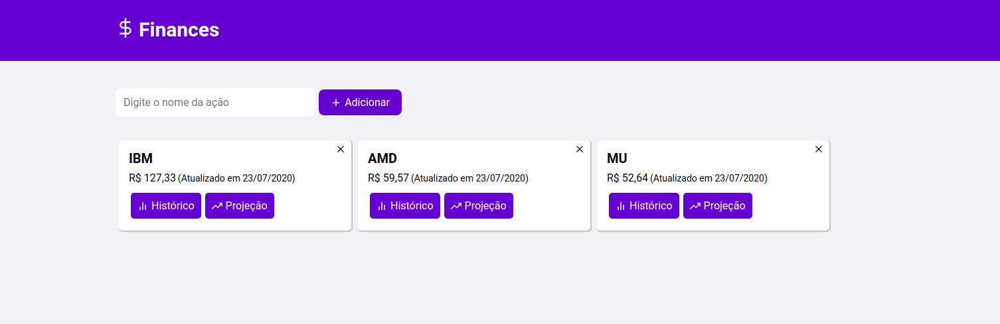
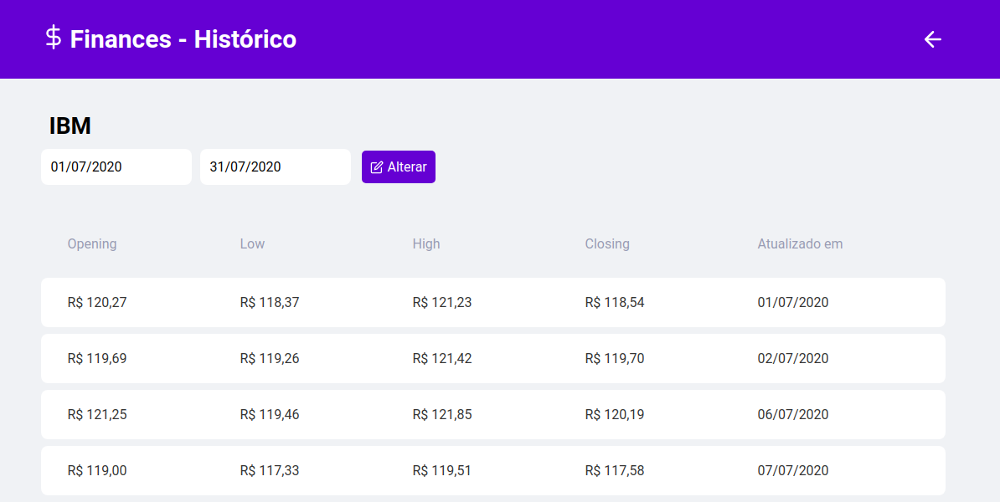
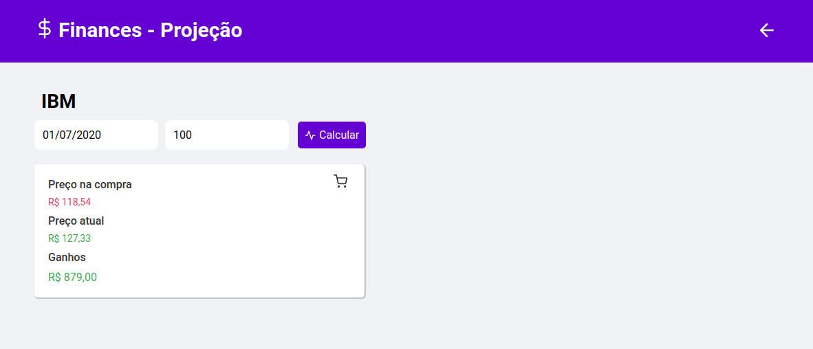

<h1 align="center">
  Finances
</h1>

### Dashboard


### Histórico


### Projeção 


## 🗒️ Sobre

Projeto criado como desafio da XL Solutions.

---

## 🚀️ O que o projeto faz?

O Finances possibilita o usuário:
- Consultar os preço atuais das ações adicionando ao seu portifólio.
- Listar o histórico da ação selecionada, informando o periódo.
- Simular os ganhos a partir de uma quantidade comprada e a data selecionada.

---

## 👨‍💻️ Tecnologias

- [Node.js](https://nodejs.org/en/)

- [Typescript](https://www.typescriptlang.org/)

- [Alpha Vantage API](https://www.alphavantage.co/documentation/)

- [ReactJS](https://reactjs.org/)

- [Styled Components](https://styled-components.com/)

---

## ⬇️ Baixe o projeto:

```bash
# Clonando o repositório
$ git clone https://github.com/marcosvcorsi/hiring.git

# Acessando o repository
$ cd hiring
```
## ⬇️ Backend:
```bash
# Acessando o backend
$ cd backend

# Instalando as dependencias
# Com Yarn
$ yarn

# Com NPM
$ npm install
```
Crie um arquivo .env, com base no arquivo .env.example contendo as seguintes variavéis
```
ALPHA_VANTAGE_URL=https://www.alphavantage.co
ALPHA_VANTAGE_APIKEY=SUA_KEY_AQUI

PORT=3333
```
Inicie o servidor com esse comandos
```bash
# Rodando o projeto na porta 3333
# Com Yarn
$ yarn dev

# Com NPM
$ npm run start

# Executando os testes
# Com Yarn
yarn test

# Com NPM
npm run test
```

## ⬇️ Frontend:
```bash
# Acessando o frontend
$ cd frontend

# Instalando as dependencias
# Com Yarn
$ yarn

# Com NPM
$ npm install
```
Crie um arquivo .env, com base no arquivo .env.example contendo as seguintes variavéis
```
REACT_APP_API_URL=http://localhost:3333
SKIP_PREFLIGHT_CHECK=true
```
Inicie o servidor com esse comandos:
```bash
# Rodando o projeto na porta 3000
# Com Yarn
$ yarn start

# Com NPM
$ npm run start
```
### Endpoints

#### `/stocks/:stock_name/quote` - Retorna a cotação mais recente para a ação ####

Entrada:

- `stock_name` - parâmetro passado na URI indicando o nome da ação (PETR4.SA, VALE5.SA)

Retorno:

```js
{
  "name": string,
  "lastPrice": number,
  "pricedAt": string // data e hora no formato ISO 8601, UTC
}
```

Exemplo de uso:

```
$ curl -H "Accept: application/json" http://coolfinancialservice.com/stock/PETR4.SA/quote
{ "name": "PETR4.SA", "lastPrice": 25.11, "pricedAt": "2017-06-23T14:15:16Z" }
```

#### `/stocks/:stock_name/history?from=<string>&to=<string>` - Retorna preço histórico da ação num intervalo inclusivo ####

Entrada:

- `stock_name` - parâmetro passado na URI indicando o nome da ação (PETR4.SA, VALE5.SA)
- `from` - string com data em formato ISO 8601
- `to` - string com data em format ISO 8601

```js
{
  "name": string,
  "prices": [<pricing>, <pricing>, ...]
}
```

O schema de `pricing` segue abaixo:

```js
{
  "opening": number,
  "low": number,
  "high": number,
  "closing": number,
  "pricedAt": string // data no formato ISO 8601, UTC
}
```

Exemplo de uso:

```
$ curl -H "Accept: application/json" http://coolfinancialservice.com/stock/PETR4.SA/history?from=2017-04-04&to=2017-04-05
{ "name": "PETR4.SA", "prices": [{ "opening": 14.67, "low": 14.57, "high": 14.89, "closing": 14.85, "pricedAt": "2017-04-04" }, { "opening": 15.05, "low": 14.50, "high": 15.16, "closing": 14.57, "pricedAt": "2017-04-05" }
```

#### `/stocks/:stock_name/compare` - Compara uma ação com uma ou mais ações ####

Entrada:

- `stock_name` - parâmetro passado na URI indicando o nome da ação (PETR4.SA, VALE5.SA)
- Payload JSON com uma lista de ações:

```js
{
  "stocks": [<string>, <string>, ...]
}
```

Retorno:

```js
{
  "lastPrices": [<lastPrice>, <lastPrice>...]
}
```

`lastPrice` tem o seguinte schema:

```js
{
  "name": string,
  "lastPrice": number,
  "pricedAt": string // data e hora no formato ISO 8601, UTC
}
```
  
Exemplo de uso:

```
$ curl -H "Accept: application/json" -H "Content-Type: application/json" -d '{ "stocks": ["TIMP3.SA", "VIVT4.SA"] }' http://coolfinancialservice.com/stock/OIBR4.SA/compare
{ "lastPrices": [{ "name": "OIBR4.SA", "lastPrice": 3.41, "pricedAt": "2017-05-18T14:15:16Z" }, { "name": "TIMP3.SA", "lastPrice": 9.93, "pricedAt": "2017-05-18T14:15:16Z" }, { "name": "VIVT4.SA", "lastPrice": 45.92 }]}
```
  
#### `/stocks/:stock_name/gains?purchasedAmount=<number>&purchasedAt=<string>` - Projeta ganhos com compra em uma data específica ####

Entrada:

- `stock_name` - parâmetro passado na URI indicando o nome da ação (PETR4.SA, VALE5.SA)
- `purchasedAmount` - `number` com o número de ações
- `purchasedAt` - `string` com data de compra em formato ISO 8601

Retorno:

```js
{
  "name": string,
  "purchasedAmount": number,
  "purchasedAt": string, // data em formato ISO 8601,
  "priceAtDate": number, // preço na data de compra
  "lastPrice": number,   // preço mais recente
  "capitalGains": number // ganhos ou perdas com a ação, em reais
}
```

Exemplo de uso:

```
$ curl -H "Accept: application/json" http://coolfinancialservice.com/stock/USIM5.SA?purchasedAmount=100&purchasedAt=2016-05-31
{ "name": "USIM5.SA", "purchasedAmount": 100, "purchasedAt": "2016-05-31", "priceAtDate": 3.97, "lastPrice": 4.33, "capitalGains": 36.0 }
```


https://www.alphavantage.co
