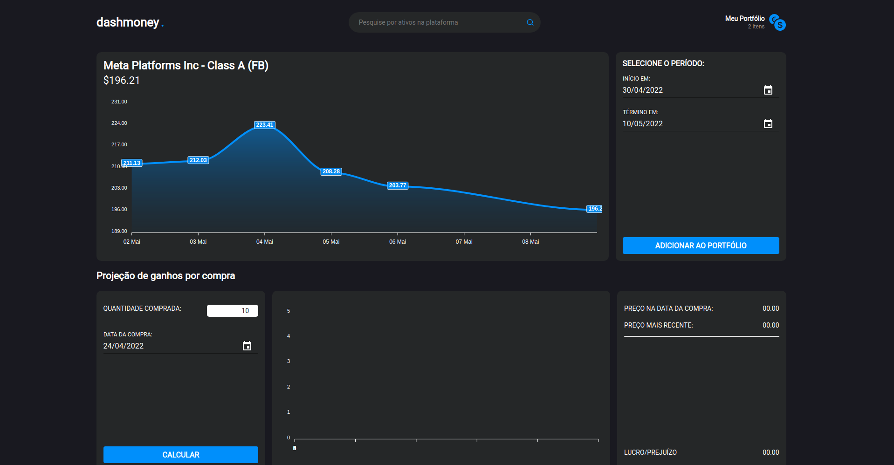

<h1 align="center">
    
</h1>

  <a href="#-tecnologias">Tecnologias</a>&nbsp;&nbsp;&nbsp;|&nbsp;&nbsp;&nbsp;
  <a href="#-projeto">Projeto</a>&nbsp;&nbsp;&nbsp;|&nbsp;&nbsp;&nbsp;
  <a href="#-como-executar">Como executar</a>&nbsp;&nbsp;&nbsp;|&nbsp;&nbsp;&nbsp;  

 

  

## ✨ Tecnologias

Esse projeto foi desenvolvido com as seguintes tecnologias:

Back-end:

- [Node](https://nodejs.org/en/)
- [Express](https://expressjs.com/pt-br/)
- [TypeScript](https://www.typescriptlang.org/)
- [Jest](https://jestjs.io/pt-BR/)
- [Swagger](https://swagger.io/)

Front-end:

- [React](https://reactjs.org)
- [Styled-components](https://styled-components.com/)
- [TypeScript](https://www.typescriptlang.org/)
- [Redux](https://redux.js.org/)
- [Redux-Saga](https://redux-saga.js.org/)
- [Jest](https://jestjs.io/pt-BR/)

## 💻 Projeto

Projeto desenvolvido para a vaga de Desenvolvedor Fullstack Junior na IPNET Growth Partner. Contém um serviço de backend especializado para os requisitos solicitados (corretora de ações) e um dashboard configurável que dará visibilidade aos dados.

OBS: PARA OBTER DADOS DAS AÇÕES FOI UTILIZADO [`ALPHA VANTAGE API`](https://www.alphavantage.co). PORTANTO, ESTA API POSSUI UMA LIMITAÇÃO DE 5 REQUISIÇÕES POR MINUTO APENAS. PARTICULARIDADE ESTA QUE INVIABILIZOU ALGUNS RECURSOS QUE AGREGARIAM AINDA MAIS AO PROJETO DESENVOLVIDO.

## 🚀 Como executar

Back-end:

- Clone o repositório
- Acesse a pasta `backend`
- Instale as dependências com `npm install ou yarn`
- Inicie o servidor com `npm run dev ou yarn dev`
- Para executar os testes automatizados `npm run test ou yarn test`

Agora você pode acessar [`localhost:4000/api-docs`](http://localhost:4000/api-docs) do seu navegador para ter acesso a documentação da API.

Front-end:

- Acesse a pasta `web`
- Instale as dependências com `npm install ou yarn`
- Inicie o servidor com `npm run start ou yarn start`
- Para executar os testes automatizados `npm run test ou yarn test`

Agora você pode acessar [`localhost:3000`](http://localhost:3000) do seu navegador.

---

Feito com ♥ por [Júlio Souza](https://www.linkedin.com/in/j%C3%BAlio-souza-079351213/) 👋🏻 
